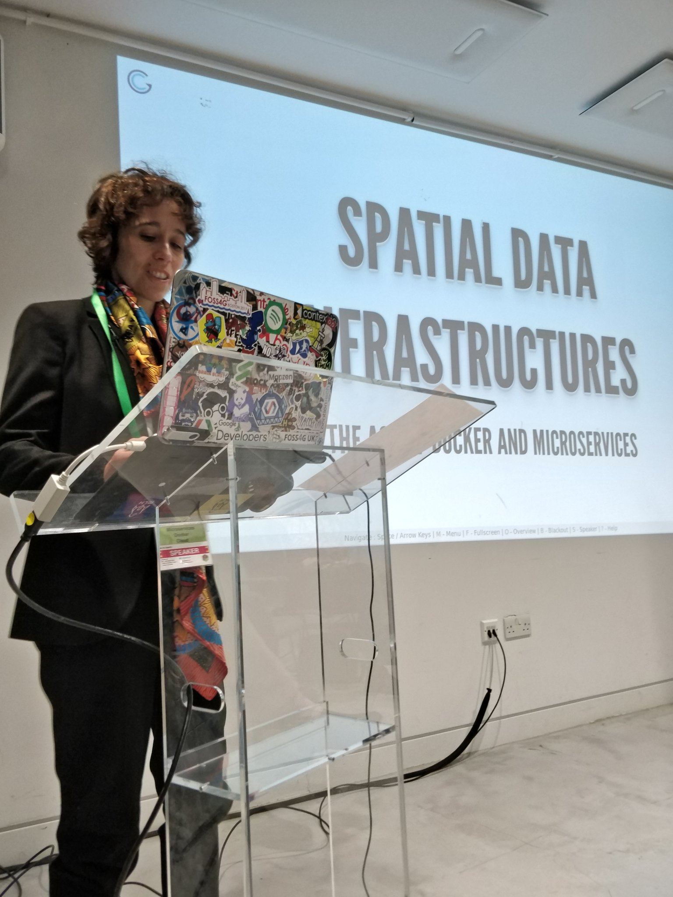

<!-- .slide: data-background="/images/slide1.png" data-background-size="100% 100%"-->


# Data Analytics

### My Journey

<!-- .element  width="30%" -->

--

## About Me


<small>
<div id="container">
  <div id="navbar" class="column1">
    <ul>
       <li >Software Engineer & Data Scientist</li>
       <li >CTO & instructor at CodeOp</li>
       <li >Founder EarthPulse</li>
       <li >Reviewer for the H2020 European Research and Innovation Programmes</li>
       <li >FOSS enthusiast, Charter member OSGeo</li>
    </ul>
  </div>
    <div id="content" class="column2">
    
  </div>
</div>

</small>

---

## PhD @UCL
Geospatial analysis, network analysis
<table style="border-collapse: collapse; color:white; border: 0px yellow solid">
    <tr>
        <td></td>
        <td></td>
        <td></td> 
        <td></td>
    </tr>
    <tr>
        <td></td> 
        <td></td>
        <td></td>
        <td></td>
    </tr>    
</table>

--
## What is Data Analytics?

- Science of analyzing raw data in order to make conclusions about that information.<!-- .element: class="fragment" -->
- Can reveal trends and metrics that would otherwise be lost in the mass of information.<!-- .element: class="fragment" -->
- Any type of information can be subjected to data analytics techniques to get insight that can be used to improve things.<!-- .element: class="fragment" -->

---
## What about Data science?

<!-- .element  width="30%" --> 


Note:
- sometimes thse terms are used interhcangebly, so I thought it would be a good idea to dive into their differences
- First of all, the similarities: Both of them are focused on asking and answering questions with data
- The differences could be the methods and tools which are used. DA is more focused on dettecting patterns and actionable insights, while DS also does forecasting. 
- In terms of methods, DA would use SQL and SAS, while DS would use programming.
- The modern conception of data science as an independent discipline has been attributed to a papper in 2001, and there is still a hype around it.

---

## Data Analytics have been around for a very long time

<!-- .element  width="40%" -->

---
## Broad Street cholera outbreak 


- 1846–1860 cholera pandemic 
- Killed 616 people
- Miasma theory 

---

## John Snow’s Investigation 

<div id="container">
  <div id="navbar" class="column1">
    <ul>
Snow hypothesized that cholera was spread by an agent in contaminated water.
  </div>
    <div id="content" class="column2">
    
  </div>
</div>

---


---
None of the workers in the nearby Broad Street brewery contracted cholera.


<!-- .element  width="70%" -->


---
Snow’s intervention led to the close of the Broad Street pump.

<div id="container">
  <div id="navbar" class="column1">
    
  </div>
    <div id="content" class="column2">
    
  </div>
</div>


--

- Do you have to use a specific software/ language/ framework?
- Do you have to know a specific algorithm/model?
- Do you have to work in a specific domain?

--
## GeoCrust (2000)
<small>
- University of Algarve, Fisheries Research
- Map effort and landings of the Portuguese crustacean fleet
- Identify fishing trips

</small>
<div id="container">
  <div id="navbar" class="column1">
    
  </div>
    <div id="content" class="column2">
    
  </div>
</div>

Note:
- 20 years later, the GPS data was used as the basis of Oversee, a system of marine surveillance developed by the Portuguese Navy and Critical Software

---
## Ciudad2020 (2014)
<small>
- BDigital, INDRA
- Smart Cities
- Use geolocated Tweets as a proxy for population distribution

</small>
<div id="container">
  <div id="navbar" class="column2">
    
  </div>
    <div id="content" class="column1">
    
  </div>
</div>

Note:
- Clustering analysis

---

## Road Traffic and Incidents (2015)
<small>
- BigData CoE and RACC
- Traffic modelling
- Road incidents
- Beware of the small rubbish trucks!

</small>
<div id="container">
  <div id="navbar" class="column1">
    
  </div>
    <div id="content" class="column1">
    
  </div>
</div>


---

## Cell phone data (2020)
<small>
- Teragence and EarthPulse
- Telco providers (e.g.: O2) want to know what is the area of influence of the different cell towers

</small>
<div id="container">
  <div id="navbar" class="column2">
    
  </div>
    <div id="content" class="column2">
    
  </div>
</div>

Note:
- Data for the entire UK

--
## What changed in these 20 years?

- Availability of data.<!-- .element: class="fragment" -->
- New technological challenges.<!-- .element: class="fragment" -->
- Availability of tools (FOSS). <!-- .element: class="fragment" -->
- Widespread use of data analysis. <!-- .element: class="fragment" -->

--
## Key skills of the Data Analyst

- Technological literacy.<!-- .element: class="fragment" -->
- Maths literacy.<!-- .element: class="fragment" -->
- Be able to understand the problem domain.<!-- .element: class="fragment" -->
- Be able to extract and communicate insights.<!-- .element: class="fragment" -->

--
## Codeop: DA Course

- Bootcamp
- Part time/ full-time

Note:
- An advance-course for professionals working in engineering, business and research and who are looking to transition to tech or level-up
- FT: July 20 
- PT: Sept 21
- Encourage to consult the website for the latest dates

---
## Course Syllabus

<!-- .element  width="80%" -->

---
## Meet our Leading Experts

<table style="border-collapse: collapse; color:black; border: 0px yellow none; font-size: 15px; vertical-align: top;">
    <tr>    
        <td></td> 
        <td></td> 
        <td></td>
    </tr>
    <tr>       
        <td style="background:none; border:none; box-shadow:none;" width="150px">Postdoctoral Researcher at 
Barcelona GSE (PhD</td>
        <td style="background:none; border:none; box-shadow:none;" width="150px">CTO at CodeOp, Founder EarthPulse (PhD)</td>
        <td style="background:none; border:none; box-shadow:none;" width="150px">Lead Data Scientist at Levi Strauss & Co. (PhD)</td>
    </tr>
    <tr>
        <td></td>
        <td></td>
        <td></td>
    </tr>
        <td style="background:none; border:none; box-shadow:none;" width="150px">Data Science consultant at the world bank</td>
        <td style="background:none; border:none; box-shadow:none;" width="150px">Senior Data Scientist at Glovo</td>
                <td style="background:none; border:none; box-shadow:none;" width="150px">Data Scientist at Spotify</td>

    </tr>
</table>

--

## Thank you!
### I would love to hear from you

<small>
<table style="border-collapse: collapse; color:black; border: 0px yellow none; font-size: 15px; vertical-align: bottom;">
    <tr>
        <td></td> 
        <td>joana@codeop.tech</td>
    </tr>
    <tr>
        <td></td> 
        <td>@doublebyte</td>
    </tr>    
    <tr>
        <td></td> 
        <td>doublebyteblog</td>
    </tr>
    <tr>
        <td></td> 
        <td>doublebyte1</td>
    </tr>  
    <tr>
        <td></td> 
        <td>Jo at CodeOp Community channel</td>
    </tr>  
</table>

</small>

--

This presentation was created using [Reveal.js](https://revealjs.com/#/), the HTML presentation framework. Fork it at:
[https://github.com/doublebyte1/DA-ppt.git](https://github.com/doublebyte1/DA-ppt.git)

```
npx reveal.js-online
```

</small>


